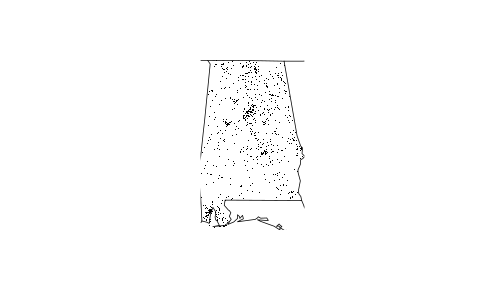

[](https://travis-ci.org/krzyklo/fars)
---
title: "Fatality Analysis Reporting System (FARS) with R programming language"
author: "Krzysztof Klos"
date: "2017-07-03"
output: rmarkdown::html_vignette
vignette: >
  %\VignetteIndexEntry{Fatality Analysis Reporting System (FARS) with R programming language}
  %\VignetteEngine{knitr::rmarkdown}
  %\VignetteEncoding{UTF-8}
---

FARS is a nationwide census providing NHTSA, Congress and the American public yearly data regarding fatal injuries suffered in motor vehicle traffic crashes.
The data files are in CSV format, often compressed. Function could read CSV and BZ2 files as well.
It has 50 variables=columns (eg. STATE, CITY, COUNTY, DAY, MONTH, YEAR, FATALS etc.), and around 30k records.
This `html_vignette` for FARS package shows basic usage of the functions provided.

## Vignette Info
This package provides 5 R language functions for working with FARS data:

- fars_read
- make_filename
- fars_read_years
- fars_summarize_years
- fars_map_state

Below we could see the location of the FARS file attached to this package.


```r
library("fars")
fars2013_path<-system.file("extdata","accident_2013.csv.bz2",package = "fars")
fars2013_path
```

```
## [1] "/home/krzys/R/build_packages/fars/inst/extdata/accident_2013.csv.bz2"
```

```r
getwd()
```

```
## [1] "/home/krzys/R/build_packages/fars/vignettes"
```

Function \code{fars_summarize_years()} shows summary for given years for each month in table.

```
## Warning in value[[3L]](cond): invalid year: 2013
```

```
## Error in fars_summarize_years(2013): could not find function "%>%"
```
Summary of fatalities for each month of 2013 year. 

Function \code{fars_map_state} shows accidents locations on the map:

